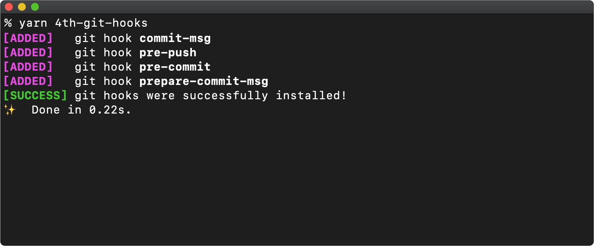

# @4th/git-hooks
> Easy to set up git hooks that can be shared between your projects.

![Version][version-image]
![License][license-image]

Handle all your git hooks in one place and share them between your projects. Changes can be made at any time - old configurations are automatically overwritten because there's only one source of truth.

<br>



<br>

## Installation

Add this package as a devDependency to your project:

```
yarn add --dev @4th/git-hooks
```

<br>

## Usage

Once the package is installed, you can initiate it with:

```
yarn 4th-git-hooks
```

Now you can specify the tasks to be performed on a particular hook. The tasks must be present in the `script` field in _package.json_.

```json
{
  "git": {
    "pre-commit": ["lint", "test"]
  }
}
```

<br>

## Behind the scenes

The initialization process extends the _package.json_ file as follows:

```json
{
  "scripts": {
    "postinstall": "4th-git-hooks"
  }
}
```

This will copy all git-hooks from the `hooks/` directory during each installation. You can always edit existing hooks or add new hooks. A list off all git hooks can be found [here](https://git-scm.com/docs/githooks).

<br>

## Customize to your needs

You can edit the files that define the coding standards as needed. You can also rename this project to `@company/git-hooks` to tailor it to your cooporate. To change the name of the initialization process, you must modify the field within `bin` in the _package.json_ file as follows:

```json
{
  "bin": {
    "company-git-hooks": "./init.js"
  },
}
```

<br>

## Further documents
- [Changelog](/docs/changelog.md)
- [Contributing](/docs/contributing.md)
- [Pull request](/docs/pull_request.md)
- [Code of conduct](/docs/code_of_conduct.md)

<br>

## Related projects

@4th/eslint-config | @4th/stylelint-config
:-------------------------|:-------------------------
[![@4th/eslint-config][eslint-image]][eslint-config] | [![@4th/stylelint-config][stylelint-image]][stylelint-config]

<br>

## License

Copyright © 2020 by 4th motion GmbH. Released under the [MIT License][license].

[version-image]: https://img.shields.io/github/package-json/v/4th-motion/git-hooks
[license-image]: https://img.shields.io/github/license/4th-motion/git-hooks
[stylelint-image]: https://avatars3.githubusercontent.com/u/10076935?s=200&v=4
[eslint-image]: https://avatars3.githubusercontent.com/u/6019716?s=200&v=4
[stylelint-config]: https://github.com/4th-motion/stylelint-config
[eslint-config]: https://github.com/4th-motion/eslint-config
[.editorconfig]: .editorconfig
[.prettierrc.js]: .prettierrc.js
[license]: LICENSE.md
